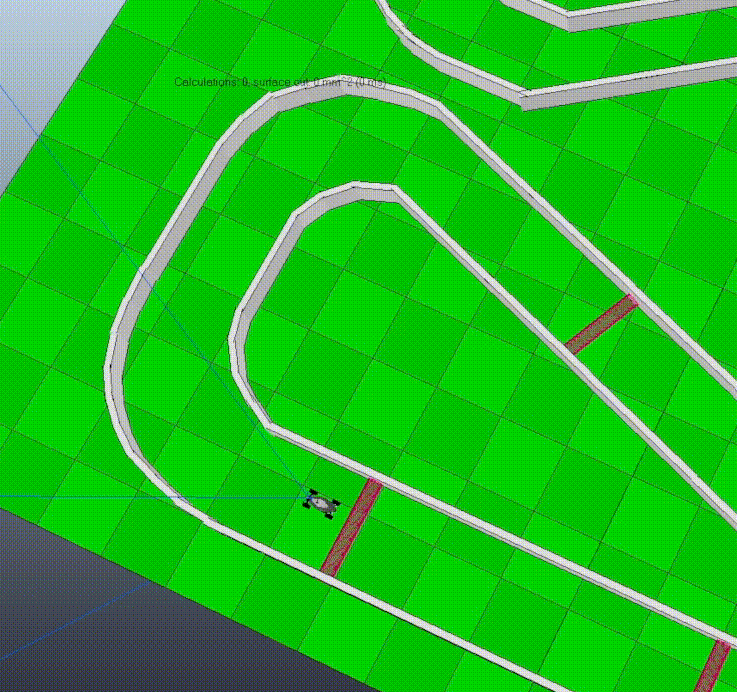

# Need4Stek :blue_car:

## $\color{green}{Grade: A}$

## About The Project

**The goal of this project is to create an autonomous car. It must be capable of driving on a track without hitting the walls or driving in the wrong direction.**

<p align="center">
  
</p>

For this we have at our disposal:

- **CoppeliaSim**, a simulator created by Coppelia Robotics. It allows to create and control robots.
  For this project, we use virtual tracks and a virtual car that will be controlled by our AI.

- An **API** (binary name: `n4s`). It's a communication interface that proposes a set of actions that we can use. It can be used alone to
  to test the command line communication protocol.

- A **shell script** (binary name: `pipes.sh`) that connects the program to the API and runs
  simulations. it is the binary to be executed once the program has been compiled.

<!-- GETTING STARTED -->

## Getting Started

You just have to clone the repository and follow the instructions below.

### Prerequisites

Clone the repositorie. On the root download and extract `CoppeliaSim`

```sh
wget https://www.coppeliarobotics.com/files/CoppeliaSim_Edu_V4_0_0_Ubuntu18_04.tar.xz

tar xvf CoppeliaSim_Edu_V4_0_0_Ubuntu18_04.tar.xz
```

Start `CoppeliaSim` with

```sh
./CoppeliaSim_Edu_V4_0_0_Ubuntu18_04/coppeliaSim.sh
```

Once the launched software loads a scene in `File` > `Open scene...` > `anyscene.ttt`
_(Scenes are stored in `n4s_paquage/scene`)_

Run the ai with `pipes.sh`

```sh
make
./pipes.sh
```

**Thank you for your interest in this project. :smile:**
